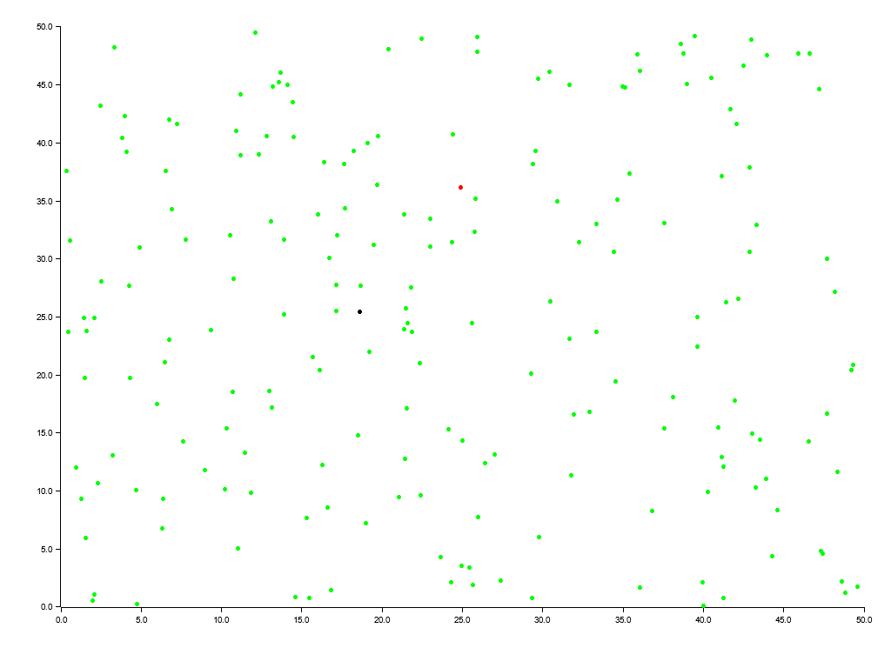
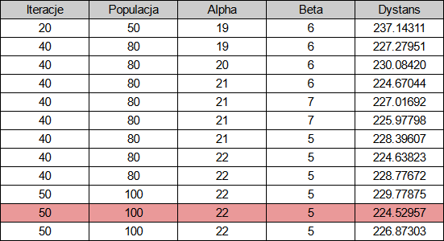
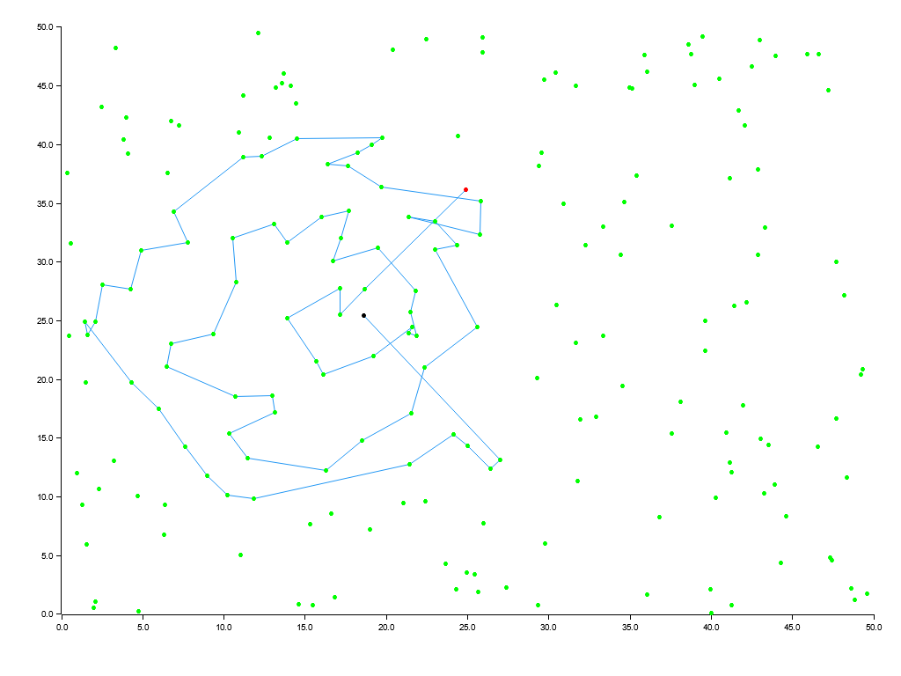

<h1 align="center">Wyznaczanie najkrótszej trasy między 2 punktami przechodzącej przez określoną liczbę innych punktów na mapie 2D</h1>

## Wprowadzenie

Poniższy projekt skupia się na rozwiązaniu problemu natury rzeczywistej.  
Otóż Pani Marianna Galica, zmęczona produkcją obuwia regionalnego z niską marżą, postanowiła zostać poszukiwaczką skarbów.  
Podczas swoich przygód, zmuszających ją do kilkukrotnej wymiany własnego obuwia, natrafiła w końcu na ruiny zamku, w którym o dziwo wszystkie pokoje były magicznie połączone ze sobą.  
Zaprosiła ona znajomą Archeolożkę, która stwierdziła, że jest to stosunkowo rzadki rodzaj ruin, po wielu dniach i nocach doszła ona do wniosku, że aby okiełznać te ruiny, trzeba znaleźć najkrótszą ścieżkę między 2 specjalnymi pokojami, która przechodzi przez 70 innych pokoi oraz nie przechodzi przez żaden pokój więcej niż 1 raz.

Stworzyła ona mapę punktów symbolizujących pokoje wykorzystując:
- Zielony kolor dla normalnych pokoi, do których możemy się przemieścić kiedykolwiek chcemy
- Czerwony kolor dla pokoju startowego
- Czarny kolor dla pokoju docelowego

Dodatkowo aby umożliwić policzenie długości danej ścieżki i móc je porównywać, tworząc mapę wykorzystała system koordynatów, oznaczając każdy pokój w miejscu od (0, 0) do (50, 50).  
Mapa została przedstawiona na Rys. 1.

    
     
    Rys. 1. Mapa pokoi, czerwony punkt oznacza pokój startowy, czarny punkt oznacza pokój docelowy

## Metodologia

Do estymacji najkrótszej ścieżki przechodzącej przez 70 pokoi wykorzystano algorytm mrówkowy.

Punkty wybierane są przez osobników w sposób losowy ważony.
Waga punktu wyliczana jest na podstawie tego, jak bliski jest on linii prostej od punktu w którym jest osobnik do punktu docelowego oraz jego wartości feromonów.
W momencie gdy punkt zostanie wybrany przez osobnika, osobnik przenosi się do niego oraz zwiększa się ilość feromonów tego punktu.

Dzięki temu droga przez którą przeszło najwięcej osobników wydaje się coraz bardziej optymalna każdemu kolejnemu osobnikowi. Z czasem prowadzi to do powstania lokalnej najlepszej ścieżki, gdzie szansa na to, że osobnik wybierze punkt który nie jest jej częścią jest znikoma.

Proces ten powtarzany jest kilkukrotnie, a z rozpoczęciem każdej iteracji rozkładane są feromony na ścieżce uznanej poprzednio za najlepszą. Zwiększona jest przez to szansa, że osobniki wybiorą ścieżkę podobną, lecz dzięki stosunkowo niskiej ilości feromonów, nie identyczną.

## Wyniki

W celu otrzymania rozwiązania jak najbliższego optymalnemu, algorytm został wywołany wielokrotnie oraz z różnymi parametrami.  
Zmieniane parametry to:

- Iteracje: ilość powtórzeń
- Populacja: ilość osobników na iteracje
- Alpha: mnożnik różnicy dystansów między punktami wykorzystywany podczas wybierania następnego punktu
- Beta: mnożnik różnicy feromonów między punktami wykorzystywany podczas wybierania następnego punktu

Uzyskane wyniki zostały przedstawione w Tab. 1. Z wygenerowanych ścieżek, najkrótsza mierzy dystans 224.52957 jednostek.

    
     
    Tab. 1. Tabela najlepszych dystansów otrzymanych przy uruchomieniu algorytmu z danymi parametrami. Najlepszy wynik został oznaczony

Najlepsza wygenerowana ścieżka została przedstawiona na Rys. 2.

    
     
    Rys. 2. Mapa przedstawiająca wygenerowaną ścieżkę przy 50 iteracjach po 100 osobników z parametrami: alpha=22, beta=5

Mapa przedstawiająca wygenerowaną ścieżkę została przekazana Mariannie, lecz po otrzymaniu mapy słuch o niej zaginął, niewiadome jest, czy uciekła z nowo zdobytym skarbem, czy może nie kontaktuje się już, bo znalazła mądrzejszego operatora.
